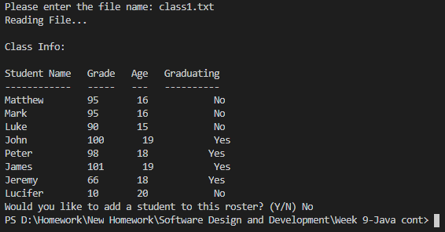
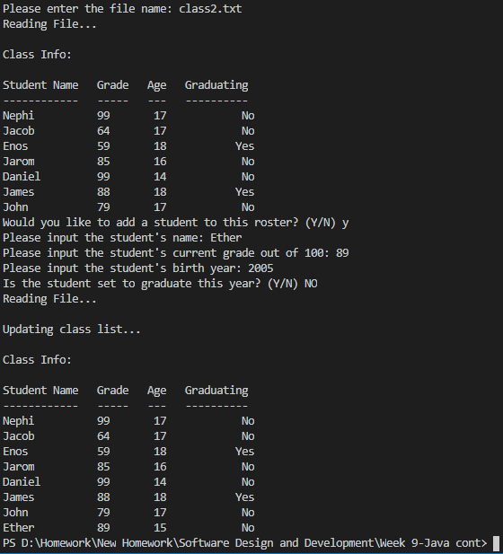

# Overview

This is a file-reading program that serves as a sort of prototype of a database accessor. It can read any file in the right format. Included are three files, named class1.txt, class2.txt, and class3.txt. The program displays the information in the file and allows the user to add to it. If the user adds to the file, it re-displays with the updated information.

# Development Environment

* Java
* Visual Studio Code

# Execution

To run: `java Main.java`   
<b>Class 1 without adding data:</b> 

 <b>Class 2 with a new student being added:</b> 

# Useful Websites

1. [Java Reference](https://web.fe.up.pt/~aaguiar/teaching/pc/Java-QuickReferenceGuide.pdf)
2. [W3Schools Java Tutorial](https://www.w3schools.com/java/)